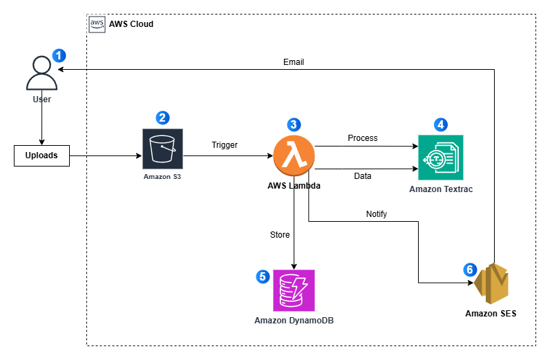
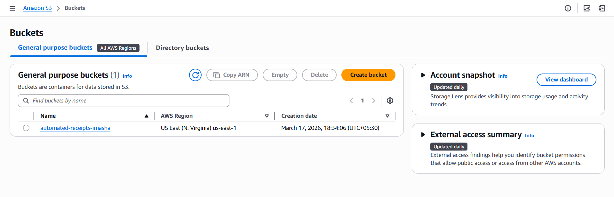
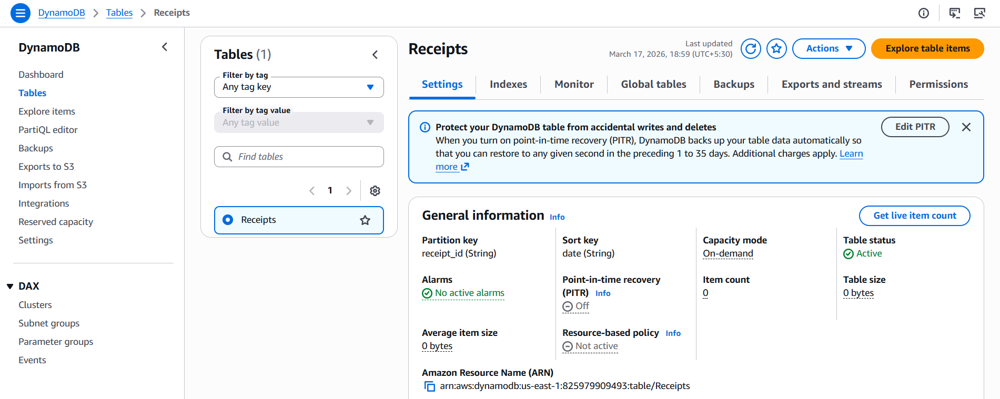
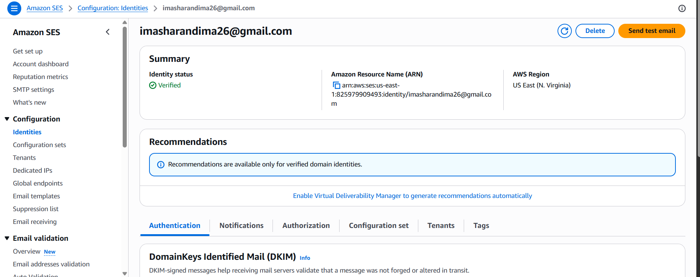
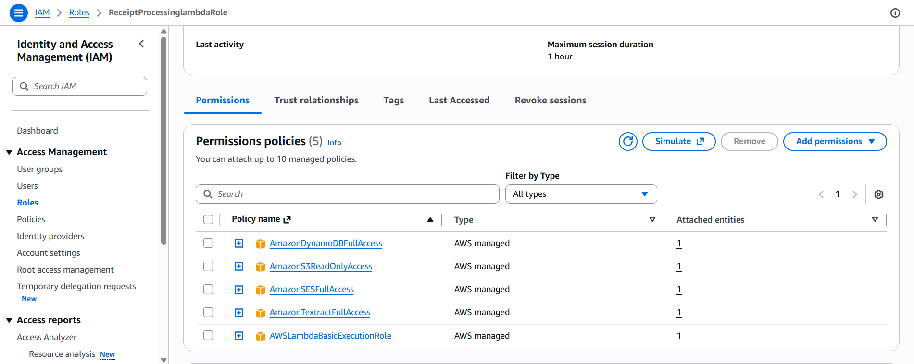
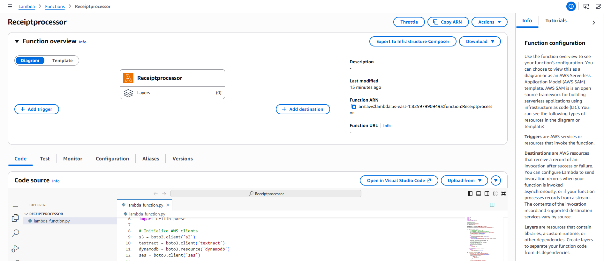

# 📄 Automated AWS Receipt Processing System

Automated receipt processing system using AWS that extracts data from uploaded receipts, stores it in a database, and sends email notifications in real time.

---

## **Table of Contents**

1. [Project Overview](#-project-overview)
2. [Architecture Diagram](#️-architecture-diagram)
3. [Features](#-features)
4. [Step 1: Create S3 Bucket](#step-1-create-s3-bucket)
5. [Step 2: Setup DynamoDB](#step-2-setup-dynamodb)
6. [Step 3: Set up Amazon SES](#step-3-set-up-amazon-ses)
7. [Step 4: Create IAM Role](#step-4-create-iam-role)
8. [Step 5: Create the Lambda Function](#step-5-create-the-lambda-function)
9. [Step 6: Configure S3 Trigger](#step-6-configure-s3-trigger)
10. [Testing the System](#-testing-the-system)
11. [Project Structure](#-project-structure)

---

## **📋 Project Overview**

This project focuses on automating receipt processing using AWS services. Instead of manually
handling receipts which can be time-consuming, error-prone, and difficult to scale-this system
extracts structured data from receipts and stores it efficiently for record-keeping and auditing.

The architecture consists of:

- Storage Layer: Amazon S3 stores receipt images and PDFs.
- Processing Layer: Amazon Textract extracts text from receipts using Al-powered OCR.
- Database Layer: DynamoDB stores the extracted data in a structured format.
- Notification System: Amazon SES sends email alerts with receipt details.
- Compute Layer: AWS Lambda automates the workflow by processing the receipts in real-time.

---

## **🏗️ Architecture Diagram**

## 

1. The user uploads the receipt to S3

2. After receipt upload to S3, the trigger invokes the lambda function

3. Lambda invokes Amazon Textract for data extraction from the receipt

4. Amazon Textract returns a structured data to lambda

5. Lambda stores the processed data from amazon textract to the DynamoDB table

6. Lambada uses amzaon ses to send email notification

---

## **✨ Features**

- **Real-time Processing**: Automatically triggers when receipts are uploaded
- **AI-Powered Extraction**: Uses Amazon Textract for accurate OCR
- **Structured Data Storage**: Stores extracted information in DynamoDB for easy querying
- **Email Notifications**: Sends receipt details via Amazon SES
- **Serverless Architecture**: Zero infrastructure management, automatic scaling
- **Secure**: IAM roles ensure least-privilege access between services

---

## **🚀 Getting Started**

## **Step 1: Create S3 Bucket**

1.  **Create the bucket:**
    - Navigate to the Amazon S3 and click the create bucket
    - Bucket type as General purpose and give a bucket name.
    - Keep all the other settings as default.
    - Navigate into newly created bucket and click create folder.
    - Rename it as incoming and create folder.



---

## **Step 2: Setup DynamoDB**

1.  **Create the Database table:**
    - Navigate to the DynamoDB and Click Create table.
    - Configure table details:
      - Table Name: Receipts
      - Partition key: receipt_id type: string
      - Sort key: date type: string
    - Leave the rest of the setting as default.



---

## **Step 3: Set up Amazon SES**

1.  **Create the Notification service:**
    - Navigate to Amazon Simple Email Service.
    - Go to Configurations and then Identities:
    - Create identity and select email address option.
    - Type your email to you receive details of receipt you upload.
    - Click create identity.
    - Then you got a verification email that you enter.
    - Go to and click the verification link.



---

## **Step 4: Create IAM Role**

1.  **Create an IAM role:**
    - Navigate to iam and click roles and create roles.
    - Select AWS services as trusted entity type.
    - Choose Lambda as service.
    - I add permisions slect five policies. They are:
      - AmazonS3ReadOnlyAccess
      - AmazonTextractFullAccess
      - AmazonDynamoDBFullAccess
      - AmazonSESFullAccess
      - AWSLambdaBasicExecutionRole
    - In role details give role name and description.
    - Click create role.



---

## **Step 5: Create the Lambda Function**

1.  **Navigate to Lambda and create a function:**
    - In create function select Author from scratch.
    - Give a function name.
    - For runtime select newest python version (Python 3.14)
    - For the architecture leave as default
    - In the permissions tab click Change default execution role.
    - Select use another role and choose the role previously we created.
    - Click Create function.

2.  **In the function got to configuration tab:**
    - Go to General configuration and click edit
    - Change the timeout to 3 min (textract processing can take time for complex receipts.)
    - Click save.
    - Next go to the, Environment variables and click edit.
    - Add three key value pairs environment variables:
      - Key:DYNAMODB_TABLE Value: Receipts
      - Key:SES_SENDER_EMAIL Value: [your_mail]
      - Key: SES_RECIPIENT_EMAIL Value: [your_mail]
    - Click Save.

3.  **Then go to Code tab.:**
    - Copy the exact code in code folder lamda.py in github project and paste in the lambda_function.py in code tab.
    - Click deploy button.



---

## **Step 6: Configure S3 Trigger**

1.  **Navigate to s3 and go to that created bucket:**
    - Go to Properties tab.
    - Then go to the event notifications section and create event notification.
    - Give an event name and prefix.
    - In Event types select All object create events.
    - Choose lambda function that previously we create.
    - Click save changes.

---

## **🧪 Testing the System**

1. Go to the bucket that created and got to the folder incoming/
2. Upload the receipt.

- ✅ Lambda execution (CloudWatch logs)
- ✅ Data stored in DynamoDB
- ✅ Email received via SES

## **📂 Project Structure**

```
Automated-AWS-Receipt-Processing-System/
│
├── code/
│      ├── lambda.py
│
├── Diagram/
│
├── Receipt_examples/
│
├── Screenshots/
│
├── README.md

```

---
